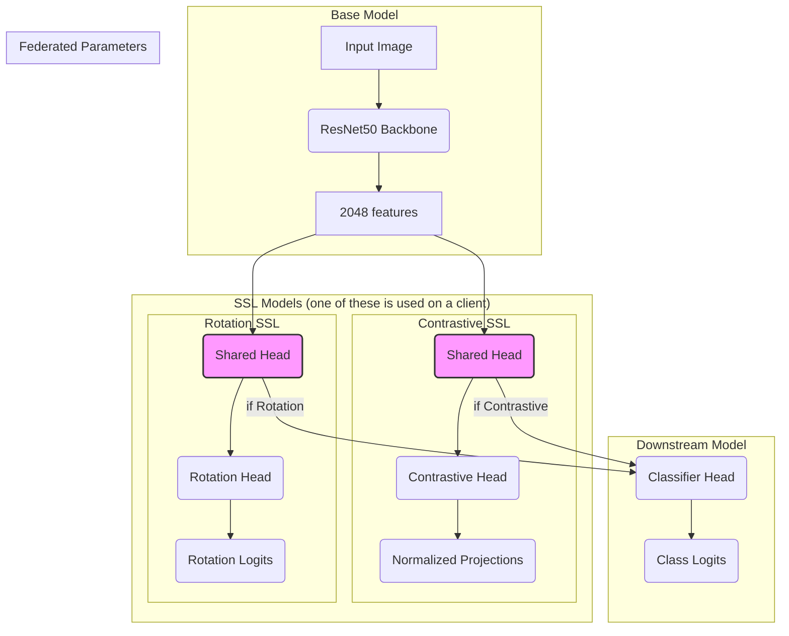
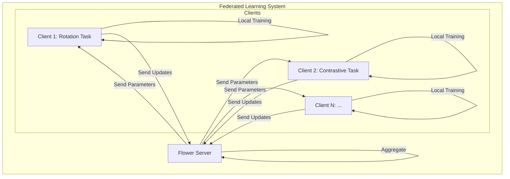
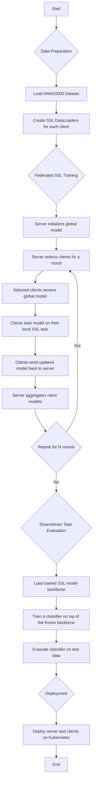
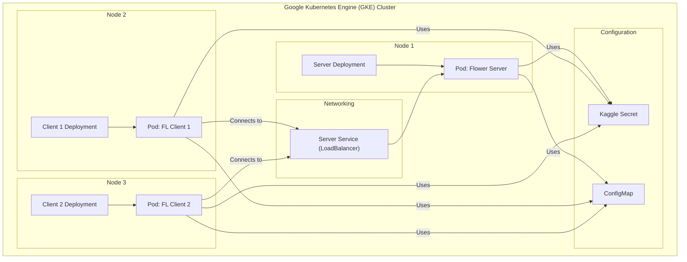

# Architecture Diagrams

## 1. Model Architecture

This diagram illustrates the neural network architectures used in the project. It shows the shared ResNet50 backbone, the different self-supervised learning (SSL) heads that are trained on the clients, and the downstream classification model. The parts of the model that are aggregated on the server during federated learning are highlighted.

## 2. Federated Learning Architecture

This diagram shows the federated learning setup. It depicts the central Flower server and multiple clients, each with its own SSL task. The server coordinates the training process, sending global model parameters to the clients and receiving updated parameters back for aggregation.

## 3. Workflow Diagram

This diagram provides a high-level overview of the entire workflow, from data preparation and federated training to model evaluation and deployment.

## 4. Kubernetes Architecture Diagram

This diagram shows how the different components of the system are deployed on a Google Kubernetes Engine (GKE) cluster. It illustrates the server and client deployments, the services for communication, and the use of secrets for configuration.

