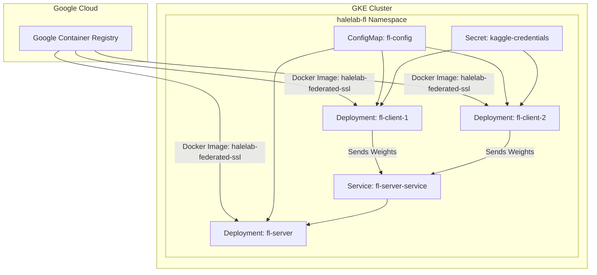

```mermaid
graph TD
    subgraph "Google Cloud"
        GCR[Google Container Registry]
    end

    subgraph "GKE Cluster"
        subgraph "halelab-fl Namespace"
            ServerDeployment[Deployment: fl-server]
            ServerService[Service: fl-server-service]
            Client1Deployment[Deployment: fl-client-1]
            Client2Deployment[Deployment: fl-client-2]
            ConfigMap[ConfigMap: fl-config]
            Secret[Secret: kaggle-credentials]
        end
    end

    GCR -- "Docker Image: halelab-federated-ssl" --> ServerDeployment
    GCR -- "Docker Image: halelab-federated-ssl" --> Client1Deployment
    GCR -- "Docker Image: halelab-federated-ssl" --> Client2Deployment

    ConfigMap --> ServerDeployment
    ConfigMap --> Client1Deployment
    ConfigMap --> Client2Deployment

    Secret --> Client1Deployment
    Secret --> Client2Deployment

    Client1Deployment -->|Sends Weights| ServerService
    Client2Deployment -->|Sends Weights| ServerService
    ServerService --> ServerDeployment
```