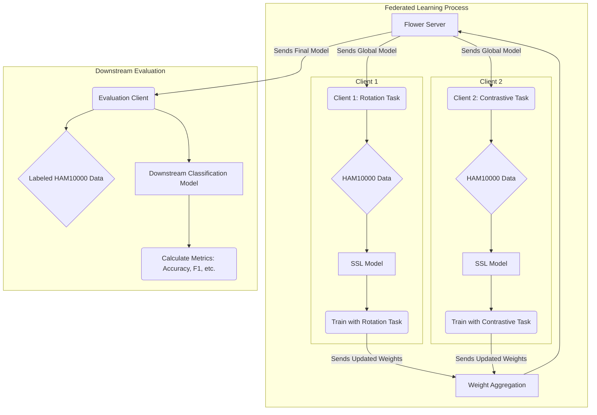

```mermaid
graph TD
    subgraph "Federated Learning Process"
        A[Flower Server] -->|Sends Global Model| B(Client 1: Rotation Task)
        A -->|Sends Global Model| C(Client 2: Contrastive Task)

        subgraph "Client 1"
            B --> D{HAM10000 Data}
            D --> E[SSL Model]
            E --> F(Train with Rotation Task)
        end

        subgraph "Client 2"
            C --> G{HAM10000 Data}
            G --> H[SSL Model]
            H --> I(Train with Contrastive Task)
        end

        F -->|Sends Updated Weights| J[Weight Aggregation]
        I -->|Sends Updated Weights| J

        J --> A
    end

    subgraph "Downstream Evaluation"
        K(Evaluation Client) --> L{Labeled HAM10000 Data}
        A -->|Sends Final Model| K
        K --> M[Downstream Classification Model]
        M --> N(Calculate Metrics: Accuracy, F1, etc.)
    end
```